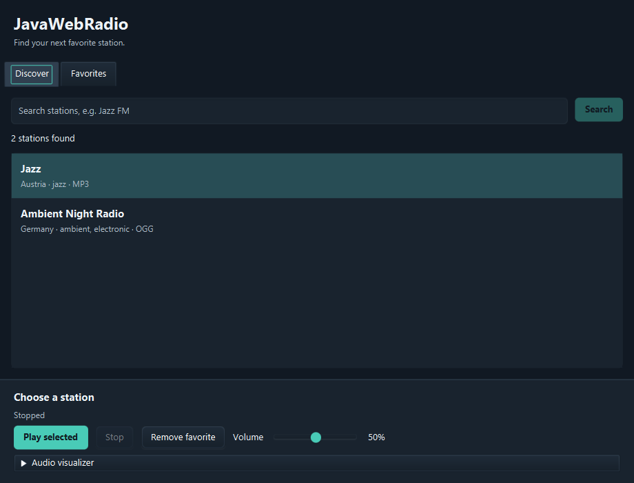

# JavaWebRadio

A modern, feature-packed internet radio player built with JavaFX. Search thousands of stations worldwide, save your favorites, and enjoy synced audio visualizations — all without any external dependencies.



## What's New in v2.1

- Station rows show names, country, genres and codec; copy a stream URL from the context menu.
- One persistent player bar across Discover and Favorites, with volume, favorite toggle, retry and a collapsible visualizer.
- Filter favorites by name, country, genre or codec.
- Search cancellation prevents old responses from replacing newer results, and failed searches offer Retry.
- Playback sessions own their resources, use network timeouts and stop without waiting on the interface thread.

Favorites are saved as JSON under `${user.home}/JavaWebRadio/favorites-v2.json`. Existing `favorites.txt` entries are imported on first launch and the original file is retained.

## What's New in v2.0

Version 2.0 is a complete rewrite of the audio engine. VLC is no longer required. The app now uses pure Java audio decoding, which means users just download and run — no extra installs needed.

Other improvements include DNS-based server discovery for the Radio Browser API (automatically finds working servers), a synced FFT visualizer that feeds directly from the audio stream instead of capturing from the microphone, proper thread management, and URL-encoded search queries.

## Features

**Global Search** — Find stations worldwide using the Radio Browser API with automatic server failover. Results are sorted by popularity and show codec info.

**Favorites** — Save, organize, and quickly access your favorite stations. Stored locally as JSON with station metadata and searchable by name, country, genre or codec.

**Audio Playback** — Supports MP3, AAC, WAV, OGG Vorbis, and FLAC streams through pure Java decoders. No VLC, no GStreamer, no native installs.

**Synced Visualizer** — Real-time FFT bar visualizer that reads directly from the audio stream. Hanning window, logarithmic amplitude scaling, and frequency boosting for a balanced display.

**Volume Control** — One persistent volume slider with real-time PCM volume scaling.

**Dark Theme** — Eye-friendly dark interface for comfortable listening.

**Persistent Player** — Current station, connection status and playback controls remain visible across tabs.

## Requirements

Java 21 or newer. That's it.

## How to Run

Clone the repo and run with Maven:

```bash
git clone https://github.com/FuLong97/JavaWebRadio.git
cd JavaWebRadio
./mvnw clean compile
./mvnw javafx:run
```

On Windows use `.\mvnw` instead of `./mvnw`.

## Project Structure

```
src/main/java/org/example/
├── Main.java                  — UI, tabs, visualizer, app lifecycle
├── UniversalAudioPlayer.java  — Pure Java audio playback via Sound SPI
├── AudioProcessor.java        — FFT analysis for visualization
└── RadioBrowserAPI.java       — DNS-based server discovery, search
```

## Tech Stack

JavaFX 21 for the UI, Java Sound SPI with mp3spi, JOrbis (OGG), and JFlac (FLAC) for audio decoding, JTransforms for FFT, Jackson for JSON parsing, and Ikonli for icons. All dependencies are managed through Maven and bundled automatically.

## Contributing

Contributions are welcome. Some areas that could use work:

- Visualizer improvements (different modes, smoother animations)
- Station metadata display (bitrate and current track)
- Playlist/queue support
- Equalizer
- System tray integration

Open an issue or submit a pull request.

## License

MIT
